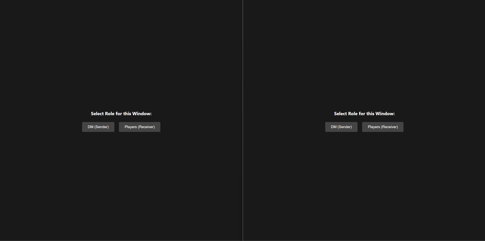

# DM Image Share

A lightweight, completely offline, and serverless dual-screen image and caption sharing tool designed specifically for tabletop Gamemasters.

If you play games like Dungeons & Dragons in person with a second TV or monitor facing your players, this single-file tool lets you instantly paste screenshots or drag-and-drop local files to display them in a beautifully organized grid.

## Key Features

- **Expandable Slots:** Start with 5 independent slots and click 'Add 5 Slots' to append another row whenever you need more room for maps, NPC portraits, and monster statblocks.
- **Drag-and-Drop Reordering:** Grab the ☰ handle on any slot and drop it onto another to instantly swap their positions—the players' screen re-arranges to match.
- **Privacy-First Workflow:** Newly pasted or dropped images are hidden from your players by default. You can quietly add captions and prepare slots, pushing them to the player screen only when you click the green 'Show' button.
- **Solo / Spotlight Mode:** Click 'Solo' on any slot to show that image or snippet by itself and instantly hide everything else—perfect for a dramatic reveal.
- **Live Captioning:** Type real-time titles or labels that instantly display below the images on the players' screen.
- **Intelligent Grid Scaling:** The player screen automatically tests different row groupings and picks whichever one displays the most image area with the least wasted space, for up to 9 active images/snippets.
- **Frictionless Uploads:** Quickly select a slot and press 'Ctrl + V' to paste a screenshot, or simply drag and drop an image file directly from your computer.
- **Magical Reveal Animation:** Newly shown images pop and fade into view on the players' screen with a subtle fantasy-themed flourish, while unchanged images stay put.
- **Master Blackout:** Instantly hide the players' screen with a single click, keeping your active layouts ready to restore at a second's notice.
- **Session Saving:** Export your entire setup—including images, custom captions, and show/hide visibility settings—into a lightweight file on your computer, allowing you to load it up instantly for your next session.
- **100% Offline & Private:** Uses your browser's built-in 'BroadcastChannel' technology. It requires no servers, no internet connection, and never uploads your images anywhere.
- **_(Experimental)_ Markdown Snippets:** Instead of an image, a slot can hold a Markdown snippet (handouts, read-aloud text, stat blocks) that's rendered on the players' screen.

---

## Demo

---

## How to Set It Up

Because this tool is built entirely into a single file, setup takes less than a minute:

1. **Save the Code:** Save the HTML code as 'share.html' on your computer.
2. **Launch the DM Control Panel:** Double-click 'share.html' to open it in your browser. Click **'DM (Sender)'**. Keep this window on your main monitor.
3. **Launch the Player View:** Open a second browser window, drag it over to your players' monitor or TV, and open 'share.html' there as well. Click **'Players (Receiver)'** and press 'F11' to make the browser fullscreen.

---

## How to Use It

### 1. Adding Images

- Click once on any slot card (it will highlight with a blue outline) and press 'Ctrl + V' to paste a screenshot.
- Alternatively, drag any image file from your computer's folders and drop it directly onto the slot card.
- Need more slots? Click 'Add 5 Slots' at the top of the DM Panel to add another row of five empty slots.

### 2. Managing the Display

- When an image is first loaded, it will appear in your control panel but remain hidden from the players.
- Click the grey 'Show' button to push it to the players' screen. The card will highlight green to confirm they can see it.
- Click 'Hide' to temporarily take it off their screen while keeping it saved in your slot.
- Click the purple 'Solo' button to show only that slot, automatically hiding every other visible slot at the same time.
- Click 'Remove' to delete the image and caption completely from the slot.

### 3. Adding Captions

- Type into the text input box below any loaded image.
- The caption will instantly display in a styled black-and-glass overlay right below the image on the players' screen.

### 4. Reordering Slots

- Grab the ☰ drag handle in a slot's header and drop it onto another slot card to swap their positions.
- The slots renumber automatically, and the players' screen re-arranges to match the new left-to-right/top-to-bottom order the next time anything is shown.

### 5. Saving & Loading Sessions (Export/Import)

- **To Save Your Work:** When your session is prepared or when a game night ends, click the 'Export Session' button at the top of the DM Panel. This will download a lightweight '.json' file containing all of your slots, images, and captions to your computer.
- Importing a session restores exactly as many slots as the file contains, so your expanded rows come back with it.
- **To Resume Your Game:** At the start of your next game, open 'share.html' on both screens, select your roles, and click 'Import Session' on the DM Panel. Choose your saved file, and your entire layout will instantly restore and sync to the players' monitor.

### 6. _(Experimental)_ Markdown Snippets

> This feature is experimental and may change or break between versions.

- Click the 📝 icon in a slot's header to open the Markdown editor popover.
- Write a snippet (headings, lists, bold/italic text, tables, read-aloud boxes, etc.) using standard Markdown syntax, then click 'Save'.
- Saving a snippet clears any image in that slot, and loading an image clears any snippet—each slot holds one or the other.
- 'Show'/'Solo'/'Hide' work exactly the same as for images, and the rendered snippet is included in the players' grid layout alongside any visible images.

### 7. Grid Rules

Rather than following a fixed table, the players' screen tries every reasonable row grouping (1 to 4 rows) for the currently visible images/snippets and keeps whichever arrangement fills the screen with the least wasted space, based on each item's real aspect ratio.

- Order is always preserved left-to-right, then top-to-bottom, matching your slot order in the DM Panel.
- A single image or snippet fills the whole screen; additional items are grouped into rows so that, as a whole, they use as much of the screen as possible.
- _Note: Any active images beyond the 9th will be safely ignored on the player screen to keep the grid looking clean._
